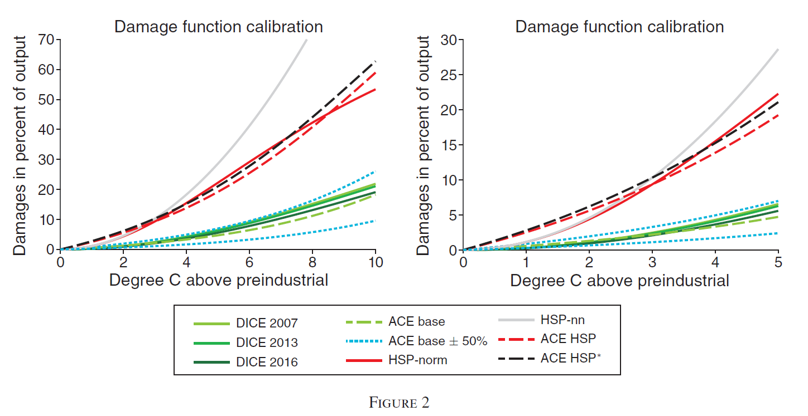
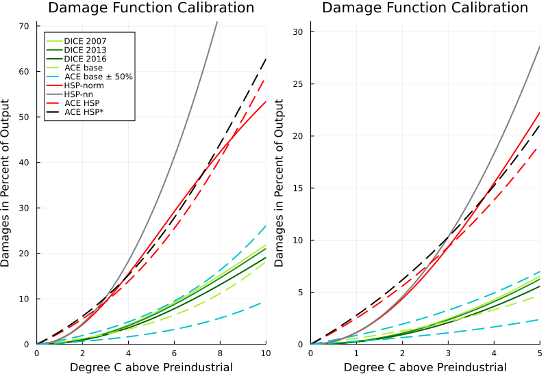
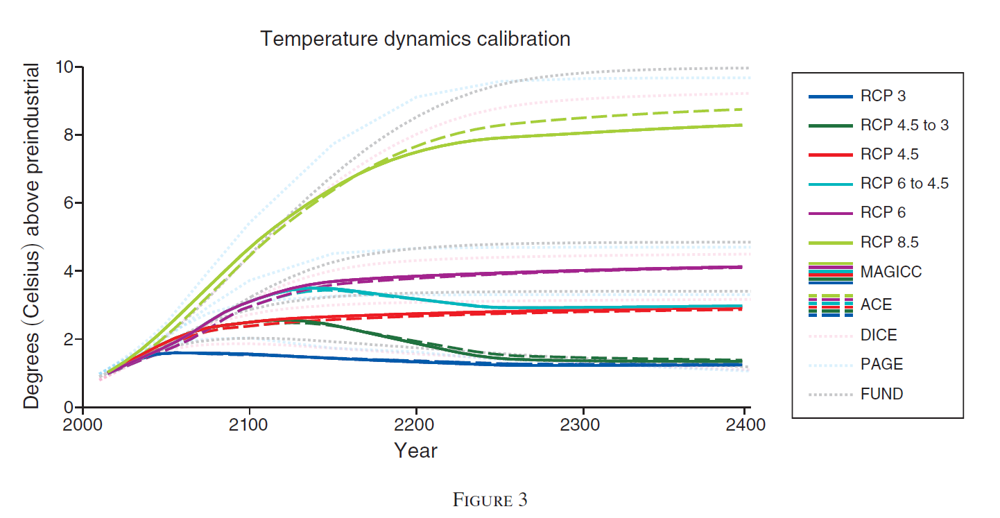
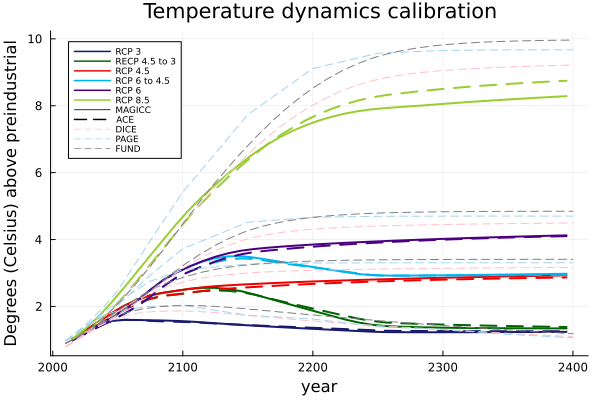
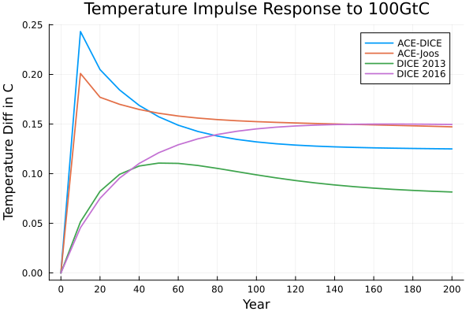
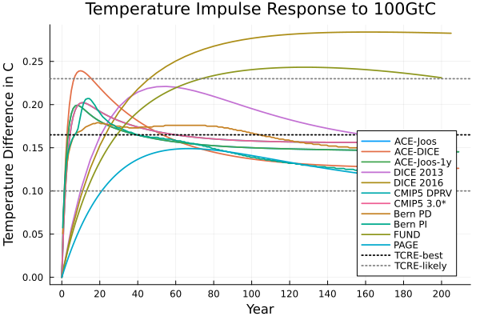

# ACE\_Traeger\_Replication.jl

**Authors**: Norbert Monti, Justine Nayral


This package reproduces the findings of Traeger, Christian P. (2023) in his paper titled 'ACE—Analytic Climate Economy,' published in the *American Economic Journal: Economic Policy*, Volume 15, Issue 3, pages 372-406. While the [original replication materials](https://www.openicpsr.org/openicpsr/project/154141/version/V1/view) provided by the author were coded in Matlab, we have used Julia to build a replication package, reproducing the main results, Figure II, Figure III, Figure IV, and Table I.

The paper examines optimal carbon taxation using integrated assessment models (IAMs) of climate change. These models are designed to evaluate the long-term interactions among economic production, greenhouse gas emissions, and global warming. C. Traeger discusses the implications of temperature and carbon tax impact. The persistence of carbon increases the optimal tax twofold to thirtyfold, depending on the calibration. On the contrary, the delay in temperature dynamics (Ocean cooling) decreases the carbon tax from 65 to 25%. The Analytic Climate Economy (ACE) model is close to Nordhaus' DICE model. It incorporates most elements of IAMs. Labor, capital, technology and energy produced output are either consumed or invested. The author distinguish "Dirty" energy sectors, consuming fossil fuels and generating greenhouse gas emissions. These gases accumulate in the atmorsphere causing radiative forcing and increase global temperature, which reduces output. This economic model aims at helping economists to develop more accurate opinions about the social cost of carbon.

## Package installation guide
You can either choose to download the package directly in the terminal or in the julia environment

### In the terminal
In order to add ACE\_Traeger\_Replication.jl take the following steps:

1. Install git. [Here's a handy guide](https://kinsta.com/knowledgebase/install-git/), depending on your OS.
2. In terminal, go to the folder where you want to save the package locally. Clone the package to your computer:

```
cd "path/where/you/want/to/save/package"
git clone https://github.com/justinenayral/ACE_Traeger_replication.jl.git
```
3. Start up a julia session and go to the source folder where ACE\_Traeger\_replication.jl is saved
```
cd("path/where/code/is/saved/ACE_Traeger_replication.jl")
```
4. Run the module
```
include("ACE_Traeger_replication.jl")
```

### In Julia environment
1. Install the package environment of your julia repl (simply tab ] to access it)
```julia
add https://github.com/justinenayral/ACE_Traeger_replication.jl
```
2. Run the package (outside the package environment)
```julia
using ACE_Traeger_replication
```

3. Go to your working directory:
```julia
cd("where/is/your/working/directory")
```

## Help
In case of issues, while running the code just use the ? in the repl, followed by the function's name, to get the help documentation.
For more information on the underlying code, click on the source button in the relevant section.

## Data availability
Our replication packages require downloading the data used by the authors from the original [replication package](https://www.openicpsr.org/openicpsr/project/154141/version/V1/view?flag=follow&pageSize=100&sortOrder=(?title)&sortAsc=true).

## Path
The user needs to provide a path where figures will be saved:
```julia
path = "C:/Users/..."
```
Figures generated are saved in path. Otherwise figures will be saved in the current directory.

## Datapath
To output some certain figures, the data provided in the original replication package is needed. The specific packages necessary are given below.
The user needs to save the data in datapath:
```julia
datapath = "C:/Users/..."
```

Otherwise function will look for data in the current directory by default.

## Packages
Before using the package, it is required to install:
```julia
using Pkg 
Pkg.add("MAT")
Pkg.add("Printf") 
Pkg.add("LinearAlgebra")
Pkg.add("DataFrames")
Pkg.add("CSV")
Pkg.add("XLSX")
Pkg.add("NLsolve")
Pkg.add("Plots")
```
## Damage functions
The authors used differents definition for calculating environmental damages. This section presents the diferent functions the user can use to calculate them, depending of the method prefer. 

#### ACE
```@docs
ACE_Traeger_replication.dam_ACE
```

#### DICE
```@docs
ACE_Traeger_replication.dam_DICE
```

#### Howard and Sterner (2017)
```@docs
ACE_Traeger_replication.dam_Sterner
```

## Figure II (Damage Function Plot)
```@docs
ACE_Traeger_replication.Damage_function_plot
```
Original figure: 


The figure generated by our package: 



## Figure III (Temperature Dynamics Simulation)
```@docs
ACE_Traeger_replication.TempFitSim
```

Original figure: 


The figure generated by our package: 



## Impulse Response Function
```@docs
ACE_Traeger_replication.Impulse_response
```

The figure generated by our package (using default options): 
 

## Figure IV (Impulse response function combined)
```@docs
ACE_Traeger_replication.Impulse_response_combined
```

Original figure: 


The figure generated by our package: 


## Table I (Social Cost of Carbon estimates)
```@docs
ACE_Traeger_replication.SCC
```
