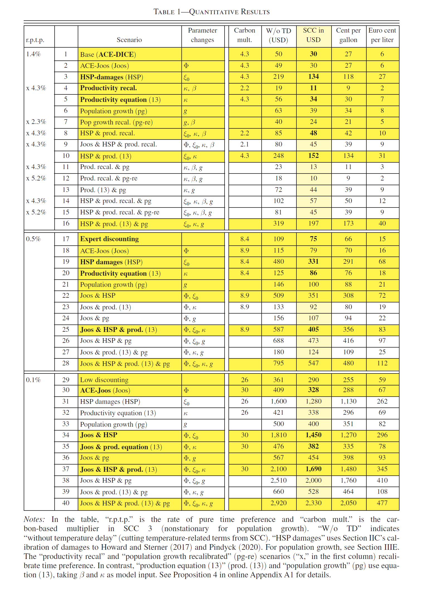
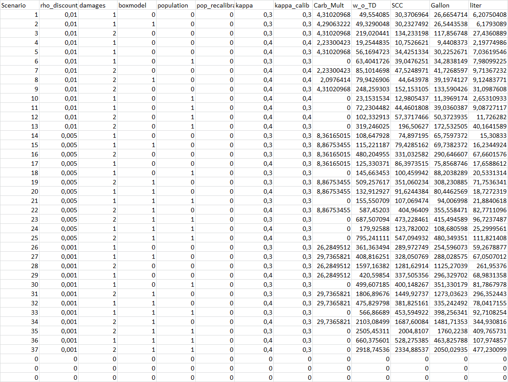

# ACE_Traeger_Replication.jl

**Authors**: Norbert Monti, Nayral Justine


This package reproduces the findings of Traeger, Christian P. (2023) in his paper titled 'ACE—Analytic Climate Economy,' published in the *American Economic Journal: Economic Policy*, Volume 15, Issue 3, pages 372-406. While the [original replication materials] (https://www.openicpsr.org/openicpsr/project/154141/version/V1/view) provided by the authors were coded in Matlab, we have used Julia to build a replication package, encompassing the main results, Figure II, Figure III, Figure IV, and Table I.

The paper examines optimal carbon taxation using integrated assessment models (IAMs) of climate change. These models are designed to evaluate the long-term interactions among economic production, greenhouse gas emissions, and global warming. C. Traeger discusses the implications of temperature and carbon tax impact. The persistence of carbon increases the optimal tax twofold to thirtyfold, depending on the calibration. On the contrary, the delay in temperature dynamics (Ocean cooling) decreases the carbon tax from 65 to 25%. The Analytic Climate Economy (ACE) model is close to Nordhaus' DICE model. It incorporates most elements of IAMs. Labor, capital, technology and energy produced output are either consumed or invested. The author distinguish "Dirty" energy sectors, consuming fossil fuels and generating greenhouse gas emissions. These gases accumulate in the atmorsphere causing radiative forcing and increase global temperature, which reduces output. This economic model aims at helping economists to develop more accurate opinions about the social cost of carbon.

## Data availability
Our replication packages require downloading the data used by the authors from the orginal [replication package](https://www.openicpsr.org/openicpsr/project/154141/version/V1/view?flag=follow&pageSize=100&sortOrder=(?title)&sortAsc=true).

## Path
The user needs to save the data and the julia package in path:
```julia
path = "C:/Users/..."
```
Figures generated are saved in path:

## Packages
Before using the package, it is required to install:
```julia
using Pkg 
Pkg.add("MAT") #To open .mat datasets
Pkg.add("Printf") #For labelling graphs
Pkg.add("LinearAlgebra")
Pkg.add("DataFrames")
Pkg.add("CSV")
Pkg.add("XLSX")
Pkg.add("NLsolve")
Pkg.add(("Plots")
```
## Dammage functions
The authors used differents definition for calculating environment damages. This section presents the diferent functions the user can use to calculate them, depending of the method he prefers. In case of issues, while running the code just use the ? in the repl, followed by the function's name, to get the documentation.

#### ACE
```@docs
ACE_Traeger_replication.dam_ACE
```

#### DICE
```@docs
ACE_Traeger_replication.dam_DICE
```

#### Howard and Sterner (2017)
```@docs
ACE_Traeger_replication.dam_Sterner
```

## Figure II
```@docs
ACE_Traeger_replication.Damage_function_plot
```

Original figure: 


The figure generated by our package: 


## Figure III
```@docs
ACE_Traeger_replication.TempFitSim
```

Original figure: 


The figure generated by our package: 


## Impulse Response Function
```@docs
ACE_Traeger_replication.Impulse_response
```

The figure generated by our package (using default options): 
 

# Figure IV: 
```@docs
ACE_Traeger_replication.Impulse_response_combined
```

Original figure: 


The figure generated by our package: 


# Table I (Social Cost of Carbon estimates)
```@docs
ACE_Traeger_replication.SCC
```

Original table: 


The table generated by our package: 
